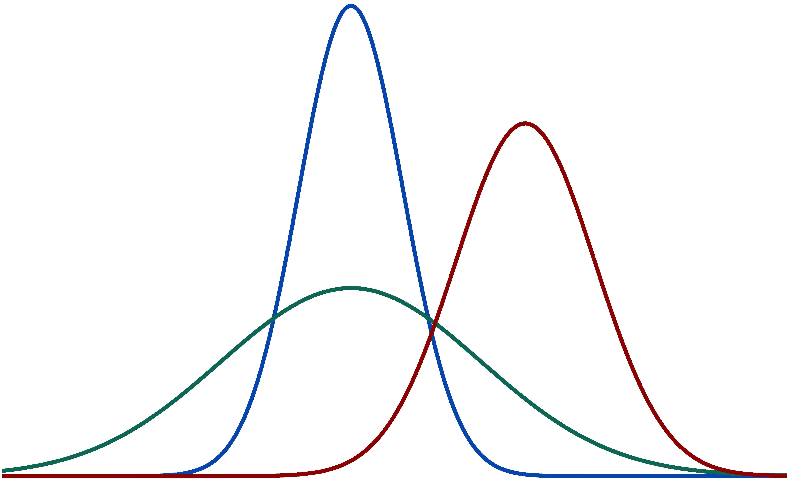

```{r, include=FALSE}
knitr::opts_chunk$set(results='asis', echo = F, message = F, warning = F)

library(glue)
library(tidyverse)
```

```{r, warning = F, message = F}
position_data <- read_csv('positions.csv')

section_id <- "education"

print_section <- function(position_data, section_id){
  position_data %>% 
    filter(section == section_id) %>% 
    arrange(desc(end)) %>% 
    mutate(id = 1:n()) %>% 
    pivot_longer(
      starts_with('description'),
      names_to = 'description_num',
      values_to = 'description'
    ) %>% 
    filter(!is.na(description) | description_num == 'description_1') %>%
    group_by(id) %>% 
    mutate(
      descriptions = list(description),
      no_descriptions = is.na(first(description))
    ) %>% 
    ungroup() %>% 
    filter(description_num == 'description_1') %>% 
    mutate(
      timeline = ifelse(
        is.na(start) | start == end,
        end,
        glue('{end} - {start}')
      ),
      description_bullets = ifelse(
        no_descriptions,
        ' ',
        map_chr(descriptions, ~paste('-', ., collapse = '\n'))
      )
    ) %>% 
    mutate_all(~ifelse(is.na(.), 'N/A', .)) %>% 
    glue_data(
      "### {title}",
      "\n\n",
      "{loc}",
      "\n\n",
      "{institution}",
      "\n\n",
      "{timeline}", 
      "\n\n",
      "{description_bullets}",
      "\n\n\n",
    )
}
```


Aside
================================================================================


{width=100%}

<i class="fa fa-envelope"></i> jonatan.smp@gmail.com\
<i class="fa fa-twitter"></i> [jonatanpallesen](https://twitter.com/jonatanpallesen)\
<i class="fa fa-github"></i> [github.com/ymer](https://github.com/ymer)\
<i class="fa fa-link"></i> [jsmp.dk](https://jsmp.dk/)

<br>

```{r}
cat("[<i class='fas fa-download'></i> Download a PDF of this CV](https://jsmp.dk/cv/cv.pdf)")
#cat("View this CV as HTML at _jsmp.dk/cv_")
```


Skills {#skills}
--------------------------------------------------------------------------------

*Programming languages*

- R 
- Python
- Julia

*Packages*

- Visualization\
  - (ggplot, shiny, matplotlib)

- Data science, R\
  - (tidyverse, tidymodels, caret, rmarkdown )
  
- Data science, Python\
  - (pandas, scikit-learn, tensorflow, statsmodels)

*Other*

- Github
- SQL
- Unix / bash


Main
================================================================================

Jonatan Pallesen {#title}
--------------------------------------------------------------------------------

I am a data scientist with a PhD in genomics. I'm curious by nature, and enjoy the challenge of separating signal from noise to gain real insights.

Throughout my education and work I have acquired extensive theoretical and practical experience with data handling, statistics, machine learning, visualization and algorithms. I am a very skilled programmer in Python, R and Julia, with more than ten years of experience in the former two.

During my work as statistical analyst and as data scientist I have worked on a variety of different projects, for which I have been in charge of all stages of the analysis, from problem definition, data cleaning and quality control, to statistical analysis, model building and presentation.


Work Experience {data-icon=laptop}
--------------------------------------------------------------------------------

```{r}
print_section(position_data, 'work')
```

<br>

Education {data-icon=graduation-cap data-concise=true}
--------------------------------------------------------------------------------

```{r}
print_section(position_data, 'education')
```

</div>
</div>
<p><br></p>
<p><br></p>
<p><br></p>
<p><br></p>
<div>
<div>

Selected public data science projects {data-icon=chart-line}
--------------------------------------------------------------------------------


::: aside
I regularly make new analyses and visualizations on [my blog](https://jsmp.dk/)
:::

```{r}
print_section(position_data, 'data_science_writings')
```


<br>

Selected Publications {data-icon=book}
--------------------------------------------------------------------------------

```{r}
print_section(position_data, 'academic_articles')
```


